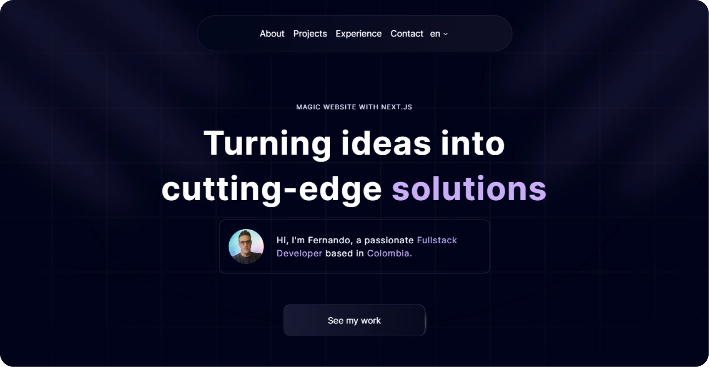

# Fernando's Portfolio

Welcome to my portfolio! Here you will find a selection of my most recent and relevant projects, as well as information about my skills and experience.

## Table of Contents

- [About Me](#about-me)
- [Projects](#projects)
- [Skills](#skills)
- [Contact](#contact)

## About Me

I'm Fernando Rojas, a passionate software developer with experience in cutting-edge technologies such as TypeScript, Next.js, Shadcn.ui, Eceternity.ui, Node, and Python, among others. I've collaborated with various companies, delivering innovative and efficient solutions. My focus lies in building robust, scalable web applications that ensure an optimal user experience and meet industry standards. You can learn more about my professional background on [LinkedIn](https://www.linkedin.com/in/fernandorojascarrillo/) and see my code on [GitHub](https://github.com/FernandoRojasCarrillo).


## Projects


### *Eva Group - Funeral Insurance Comparator*

On this web platform, you can **compare various funeral insurance** policies to find the one that best suits your needs. Additionally, on **Eva Seguros' Blog**, you'll find a variety of articles explaining what funeral insurance is and how you can purchase it through our comparison tool.

#### Technologies

`Next.js` `Shadcn.ui` `JavaScript` `internationalization`

[segurodedecesos.com](https://www.segurodedecesos.com/)

---


### *Video Game Comparison Platform*

Discover the most enjoyable way to **compare video game prices on major platforms** and find perfect deals within your budget. This platform provides an exceptional user experience, designed specifically for **gaming enthusiasts in Madrid.**

`Next.js` `Shadcn.ui` `JavaScript` `internationalization`

[videojuego.madrid](https://www.videojuego.madrid/)


## Skills

`Next.js`
`React.js`
`JavaScript`
`TypeScript`
`Shadcn.ui`
<br/>

`Eceternity.ui`
`HTML/CSS`
`Node.js`
`Java`
`Python`
<br/>

`Nest.js`
`SQL`
`Git`


## Contact

You can reach me through the following means:

- **Email:** [diego27fernando72@gmail.com](mailto:diego27fernando72@gmail.com)
- **LinkedIn:** [@fernandorojascarrillo](https://www.linkedin.com/in/fernandorojascarrillo/)
- **GitHub:** [@FernandoRojasCarrillo](https://github.com/FernandoRojasCarrillo)
- **Phone:** [+57 320 2074 828](https://wa.me/573202074828)


> [!NOTE]
> ### Starting the Project Locally

To start the project locally, run one of the following commands:

```bash
npm run dev
# or
yarn dev
# or
pnpm dev
# or
bun dev
```

Thank you for visiting my portfolio! 😊👋


